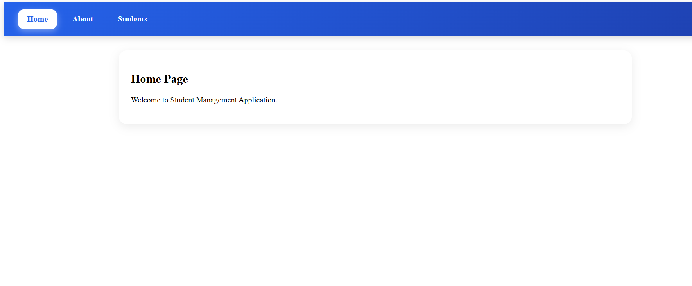
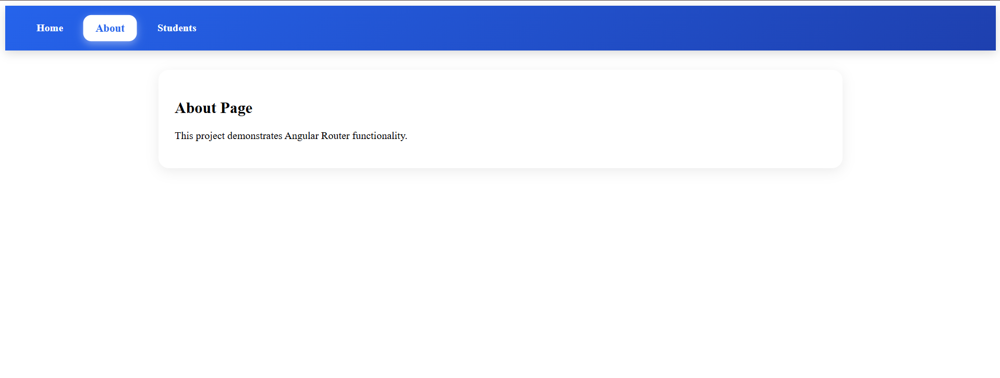
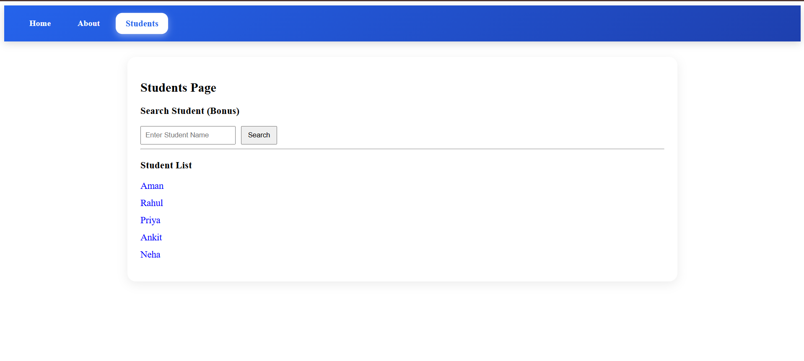

# 🚀 Day 12 Assignment - Angular Router Multi-Page SPA

## 📌 Overview

This project demonstrates Angular Routing by building a Multi-Page Single Page Application (SPA) using Angular Router.

The application contains:

* Home Page
* About Page
* Students Page
* Student Detail Page
* Dynamic Routing
* Route Parameters
* Query Parameters
* Navigation Bar with Active Link Highlighting

---

## 🎯 Assignment Requirements

### ✅ Home Component

Displays the landing page of the application.

### ✅ About Component

Displays information about the project.

### ✅ Students Component

Displays a list of students and provides search functionality.

### ✅ Student Detail Component

Displays the selected student's ID using route parameters.

### ✅ Angular Router

Configured routes:

| Route         | Component      |
| ------------- | -------------- |
| /             | Home           |
| /about        | About          |
| /students     | Students       |
| /students/:id | Student Detail |

---

## 🛠 Technologies Used

* Angular 20
* TypeScript
* HTML5
* CSS3
* Angular Router

---

## ✨ Features

### Navigation Bar

* Home
* About
* Students
* Active route highlighting

### Dynamic Routing

Clicking a student navigates to:

```bash
/students/:id
```

Example:

```bash
/students/101
```

### Route Parameters

Uses:

```ts
ActivatedRoute
```

to retrieve the student ID.

### Go Back Navigation

Uses:

```ts
Router.navigate()
```

to return to the Students page.

### Bonus Feature - Query Parameters

Search student name:

```bash
/students?search=Aman
```

Displays entered search value dynamically.

---

## 📷 Application Screenshots

### Home Page



### About Page



### Students Page




---

## 📂 Project Structure

```text
DAY-12
│
├── student-app
│
├── Images
│   ├── home.png
│   ├── about.png
│   ├── students.png
│   └── student-detail.png
│
└── README.md
```

---

## ▶️ Run Project

```bash
npm install
ng serve
```

Navigate to:

```bash
http://localhost:4200
```

---

## 📚 Learning Outcomes

* Angular Routing
* RouterLink
* RouterLinkActive
* Dynamic Routes
* Route Parameters
* Query Parameters
* Navigation between Components
* Single Page Application Architecture

---

## 👨‍💻 Author

Shaily Kumar

Angular Heritage Training Program - Day 12 Assignment
