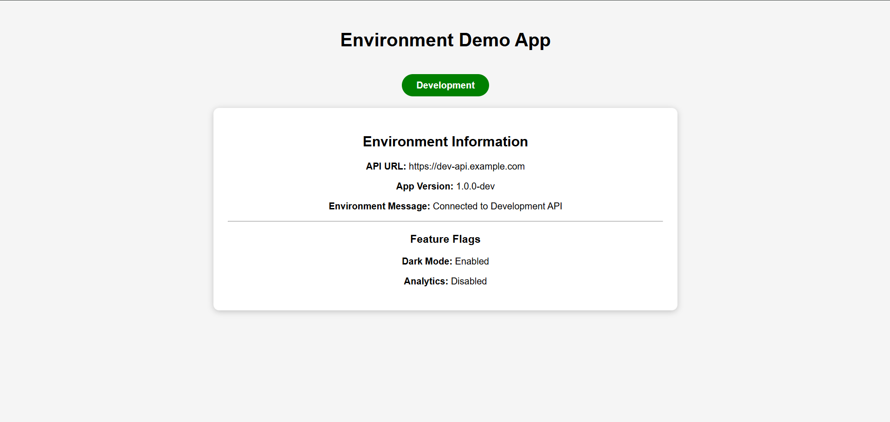
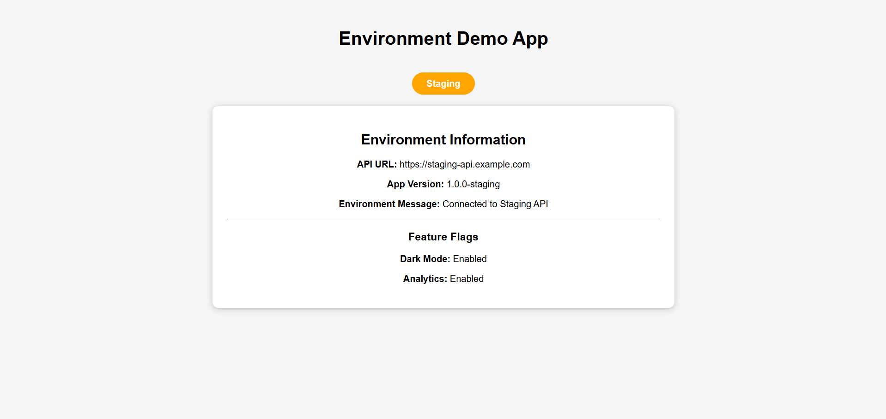
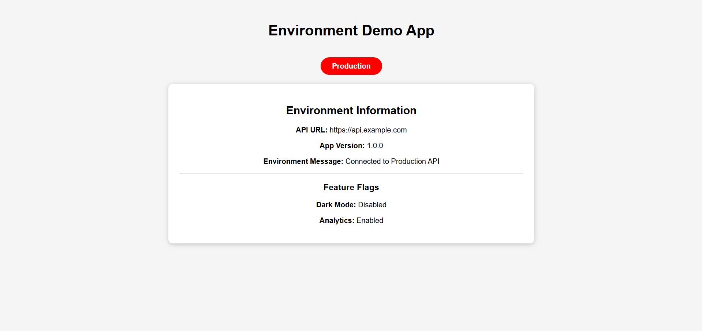

# 🌍 Environment Demo App

> **DAY-9 Assignment - Angular Multi-Environment Configuration**
> ### ✨ Enterprise-Level Angular Architecture with Feature Modules, Shared Modules, Lazy Loading & Reusable Components


<br>

An Angular application demonstrating the use of multiple environments (**Development, Staging, and Production**) using Angular Environment Files, Environment Service, Feature Flags, and Environment-Specific Configuration.

---

## 📌 Assignment Objectives

This project demonstrates:

* Angular Environment Configuration
* Environment File Replacement
* Development, Staging, and Production Environments
* Environment Service
* Feature Flags
* Environment-Specific Behavior
* Build Configurations
* API Endpoint Management
* Application Version Management

---

## 🚀 Technologies Used

* Angular 19+
* TypeScript
* HTML5
* CSS3
* Angular CLI

---

## 📂 Project Structure

```text
env-demo-app
│
├── src
│   │
│   ├── Images
│   │   ├── Development.png
│   │   ├── Staging.png
│   │   └── Production.png
│   │
│   ├── environments
│   │   ├── environment.ts
│   │   ├── environment.staging.ts
│   │   └── environment.prod.ts
│   │
│   ├── app
│   │   ├── services
│   │   │   └── environment.service.ts
│   │   ├── app.ts
│   │   ├── app.html
│   │   ├── app.css
│   │   ├── app.config.ts
│   │   └── app.routes.ts
│   │
│   ├── main.ts
│   └── styles.css
│
├── angular.json
├── package.json
└── README.md
```

---

# ⚙️ Environment Configuration

## Development Environment

```typescript
apiUrl: https://dev-api.example.com
appVersion: 1.0.0-dev
enableDarkMode: true
enableAnalytics: false
```

## Staging Environment

```typescript
apiUrl: https://staging-api.example.com
appVersion: 1.0.0-staging
enableDarkMode: true
enableAnalytics: true
```

## Production Environment

```typescript
apiUrl: https://api.example.com
appVersion: 1.0.0
enableDarkMode: false
enableAnalytics: true
```

---

# 🛠️ Environment Service Features

The application includes a dedicated Environment Service that:

* Retrieves environment configuration
* Checks feature availability
* Provides environment-specific API messages
* Handles environment-specific behavior

### Service Methods

```typescript
getEnvironment()
isFeatureEnabled(featureName)
getApiMessage()
```

---

# 🎨 Application Features

✅ Environment Badge

✅ API URL Display

✅ App Version Display

✅ Environment Message Display

✅ Feature Flags Display

✅ Environment-Specific Configuration

✅ Multi-Environment Build Support

---

# 🖥️ Application Output

## Development Environment

🟢 **Green Badge**



---

## Staging Environment

🟠 **Orange Badge**



---

## Production Environment

🔴 **Red Badge**



---

# 📸 Environment Verification

### Development Environment

```bash
ng serve
```

**Output Details**

* Environment: Development
* API URL: https://dev-api.example.com
* Version: 1.0.0-dev
* Dark Mode: Enabled
* Analytics: Disabled

---

### Staging Environment

```bash
ng serve --configuration=staging
```

**Output Details**

* Environment: Staging
* API URL: https://staging-api.example.com
* Version: 1.0.0-staging
* Dark Mode: Enabled
* Analytics: Enabled

---

### Production Environment

```bash
ng serve --configuration=production
```

**Output Details**

* Environment: Production
* API URL: https://api.example.com
* Version: 1.0.0
* Dark Mode: Disabled
* Analytics: Enabled

---

# 📦 Installation

Clone the repository:

```bash
git clone <repository-url>
```

Navigate to project directory:

```bash
cd env-demo-app
```

Install dependencies:

```bash
npm install
```

---

# ▶️ Run Application

## Development

```bash
ng serve
```

Open:

```text
http://localhost:4200
```

## Staging

```bash
ng serve --configuration=staging
```

## Production

```bash
ng serve --configuration=production
```

---

# 🏗️ Build Commands

## Development Build

```bash
ng build
```

## Staging Build

```bash
ng build --configuration=staging
```

## Production Build

```bash
ng build --configuration=production
```

---

# 📊 Environment Comparison

| Feature     | Development         | Staging                 | Production      |
| ----------- | ------------------- | ----------------------- | --------------- |
| API URL     | dev-api.example.com | staging-api.example.com | api.example.com |
| App Version | 1.0.0-dev           | 1.0.0-staging           | 1.0.0           |
| Dark Mode   | ✅ Enabled           | ✅ Enabled               | ❌ Disabled      |
| Analytics   | ❌ Disabled          | ✅ Enabled               | ✅ Enabled       |
| Badge Color | 🟢 Green            | 🟠 Orange               | 🔴 Red          |

---

# 🎯 Assignment Requirements Covered

| Requirement                   | Status |
| ----------------------------- | ------ |
| Angular Project Creation      | ✅      |
| Environment Files             | ✅      |
| Staging Configuration         | ✅      |
| Production Configuration      | ✅      |
| Environment Service           | ✅      |
| Feature Flags                 | ✅      |
| API URL Management            | ✅      |
| App Version Management        | ✅      |
| Environment-Specific Behavior | ✅      |
| UI Display                    | ✅      |
| Build Configurations          | ✅      |
| README Documentation          | ✅      |

---

# 👨‍💻 Author

**Aman Kumar**

B.Tech Computer Science Engineering

NIST University

---

# ⭐ Conclusion

This project successfully demonstrates Angular's multi-environment configuration using Development, Staging, and Production environments. The application dynamically switches configurations using Angular's file replacement mechanism and showcases environment-specific behavior through a dedicated Environment Service.
