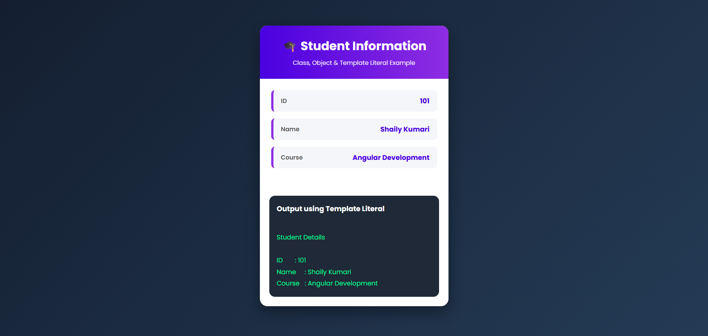

# 🎓 Student Class App (Angular)

A simple Angular application that demonstrates the concepts of **Class**, **Object**, and **Template Literals** using TypeScript.

## 📌 Objective

Create a `Student` class with the following properties:

- ID
- Name
- Course

Create an object of the `Student` class and display the student details using a **Template Literal**.

---

## 🚀 Technologies Used

- Angular
- TypeScript
- HTML5
- CSS3

---

## 📂 Project Structure

```
student-class-app/
│── src/
│   ├── app/
│   │   ├── app.ts
│   │   ├── app.html
│   │   ├── app.css
│   │   ├── student.ts
│   │   ├── app.config.ts
│   │   └── app.routes.ts
│   │
│   ├── images/
│   │   └── Output.png
│   │
│   ├── main.ts
│   └── index.html
│
├── angular.json
├── package.json
└── README.md
```

---

## ✨ Features

- Create a Student class
- Create a Student object
- Display student details
- Use Template Literals
- Modern responsive UI
- Built with Angular Standalone Components

---

## 🖥️ Output



---

## 📖 Concepts Covered

- TypeScript Class
- Constructor
- Object Creation
- Object Properties
- Template Literals
- Angular Components
- Data Binding

---

## ⚙️ Installation

Clone the repository

```bash
git clone <repository-url>
```

Navigate to the project

```bash
cd student-class-app
```

Install dependencies

```bash
npm install
```

Run the project

```bash
ng serve
```

Open your browser and visit:

```
http://localhost:4200
```

---

## 📸 Preview

The application displays:

- Student ID
- Student Name
- Student Course
- Template Literal Output

with a clean and modern Angular user interface.

---

## 👨‍💻 Author

**Aman Kumar**

GitHub: https://github.com/Shaily-kumari5

---

⭐ If you found this project helpful, consider giving it a star!
